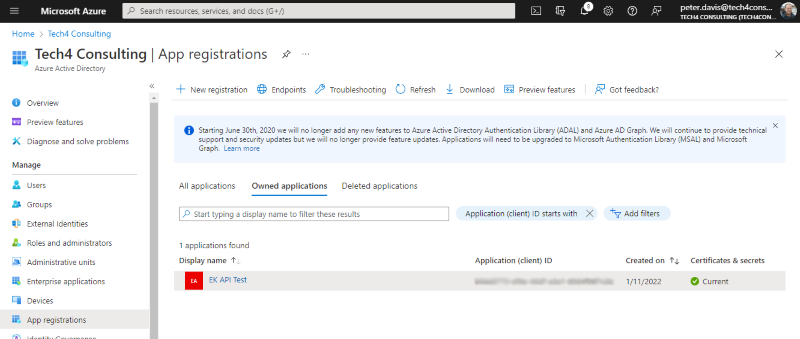
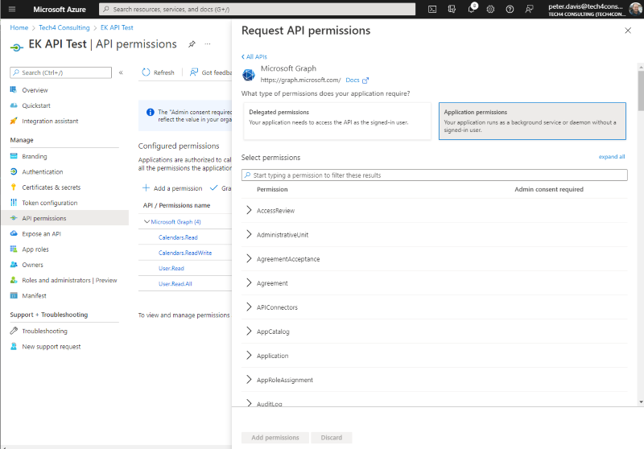
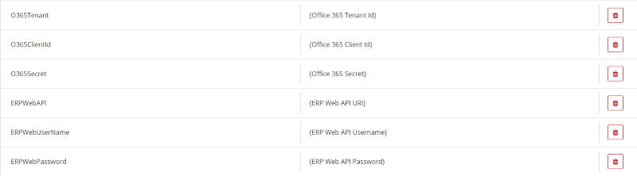

# ERP Absence to Office 365 Calendar (ERP7 & ERPx)

This flow is designed to push approved absences through to a users Office 365 Calendar.  

At present it gets a users email (Office 365 account ID) from the emil address associated with the general address (address type 1) of the resource.  This could be adjusted to get the email from the user master file if required.

This flow has been built in ERP7 however it should work correctly in ERPx if the login for the ERP Web APIs is changed from basic to provide a token from Unit4 IDS.

It requires setup in both extension kit and an Azure AD tenant.

Calendar entries are created with 'Absence Code description' and 'Absence Reason description' as the subject:

## Created By

Peter Davis ([Tech4ConsultingDev](https://github.com/Tech4ConsultingDev)/[PancheSoftwareDev](https://github.com/PanacheSoftwareDev)) - Tech4 Consulting - [peter.davis@tech4consulting.com](mailto:peter.davis@tech4consulting.com)

## Download Flows

The exported flow can be found in the following location, you will need both JSON files and these can be imported into your Extension Kit instance via the 'Import' button within the 'Flows' area.

- [Flow Exports](FlowExport/)

## Concepts Covered

- Message Hub Event
- Calling Unit4 ERP Public APIs
- Liquid Scripting
- Calling external APIs using 'Bearer Token' authentication

This flow runs on the 'workflowtransactions' document message hub event which allows it to pick up absences (element type: ABSA) that have finished workflow.  

Along with making calls back to the ERP public APIS (to get attribute value descriptions) it also contains some Liquid Scripting that looks at the 'timeFrom' and 'timeTo' integer values associated with the absence and adds those to the 'dateFrom' and 'dateTo' so that the calendar entry is created with the correct time span.  I think that this scripting could be improved and I'll refine it if I find better ways to process the values. 

## Azure AD configuration

To enable this functionality a new app registration must be made in the Azure AD associated with your Office 365 accounts, this will allow extension kit to access the Microsoft Graph APIs without the need for a specific user to login.

Access the Azure AD via [https://azure.portal.com](https://azure.portal.com)

Navigate to the 'Azure AD' area and choose 'App Registration from the menu on the left:

Choose 'New Registration' at the top of the tab, provide a name of your choice and choose 'Accounts in this organisational directory only - Single tenant'

Once the app is created click on it and choose 'API permissions' from the menu on the left and then 'Add a permission', make sure you choose 'Microsoft Graph' and then choose the 'Application permissions' followed by the permissions you require, in this instance we will be making use of 'Calendars.ReadWrite' but you can choose other permissions if you want.

Once you've choosen permissions make sure you press 'Grant admin consent for XXXXXX' on them so that you don't have to login an grant these individually.

Finally click on 'Certificates & secrets' on the menu on the left and press 'New client secret'.  You can choose a name of your choice but make sure you copy the secrets value as it won't be shown again.

Make a note of the Client secret along with the 'Application (client) ID' and 'Directory (tenant) ID' from the following screen as you will need these for parameters within extension kit.

## Extension Kit Parameters

The following parameters must be setup within Extension Kit and are required for the flow to work correctly:

You should use values appropriate to your environment and 'O365' values from the 'Azure AD Configuration' section above.

