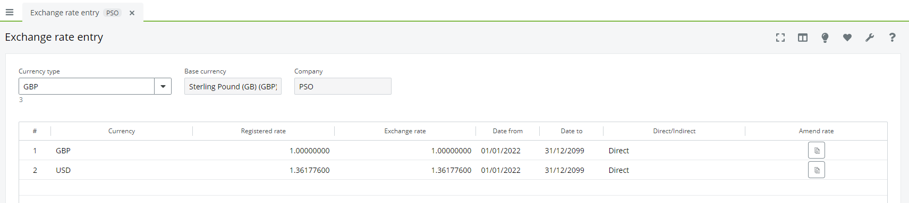
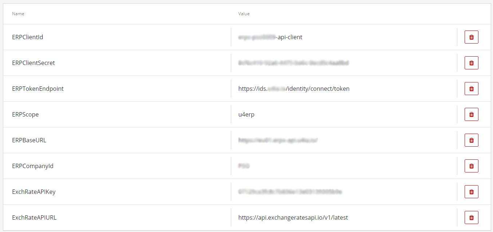

# Exchange Rate Import

This flow is designed to Import exchange rates into ERPx, it can be scheduled to run once a day and requires a minimal amount of configuration beyond adding appropriate endpoint URLs and authorisation details.

This flow will currently only work on ERPx as the ERP Exchange Rate Public API required to import new exchange rates is not available on ERP7.

## Created By

Peter Davis ([Tech4ConsultingDev](https://github.com/Tech4ConsultingDev)/[PancheSoftwareDev](https://github.com/PanacheSoftwareDev)) - Tech4 Consulting - [peter.davis@tech4consulting.com](mailto:peter.davis@tech4consulting.com)

## Download Flows

The exported flow can be found in the following location, you will need both JSON files and these can be imported into your Extension Kit instance via the 'Import' button within the 'Flows' area.

- [Flow Exports](FlowExport/)

## Exchange Rate API

To use this Flow you will require an API access key to use and external exchange rate API.

This example uses [https://exchangeratesapi.io/](https://exchangeratesapi.io/) which requires at least a 'Basic' subscription ($9.99 a month) to allow for requests to be made specifying a base currency, which is required for this flow.

Alternative APIs are availble, like [https://openexchangerates.org/](https://openexchangerates.org/) and the majority provide data in the same format as [https://exchangeratesapi.io/](https://exchangeratesapi.io/) so you should be able to use an alternative without any changes, or just minor tweaks.

## Concepts Covered

- Scheduled Events
- Calling Unit4 ERPx Public APIs using 'Bearer Token' authentication
- Liquid Scripting
- Calling external APIs

This flow contains a lot of automation to ensure that it works without the need for complex configuration that needs to change from environment to environment.

The Exchange Rates API provided by ERPx only allows you to POST exchange rates where one already exists in ERPx, so with the following Currency Type the API will only allow you to import exchange rates for GBP and USD, if you want to add more you will need to create them through this Exchange Rate Entry screen first before the Extension Kit Flow will load them.

This Extension Kit flow performs the following actions.

- Get the current accounting period for the company using the 'Companies' API
- Extract all current 'Currency Types' from ERPx (for the current accounting period) using the 'Attribute Values' API
- For each 'Currency Type' get all existing exchange rate currency codes for that 'Currency Type' from the 'Exchange Rates Entry' API
- Issue a request to [https://exchangeratesapi.io/](https://exchangeratesapi.io/) to retrieve current exchange rates, based on the current 'Currency Type' base currency and the applicable exchange rates
- POST new exchange rates back to ERPx using the 'Exchange Rates' API

## Liquid Scripting

To enable the automation above a substantial amount of Liquid scripting is used to both parse data coming in from External APIs and also to assemble data ready to be posted back into ERPx.

Get in contact if you think it is worth me breaking down some of this script to explain it more.

## Parameters

The following Parameters are required for this flow:

- ERPClientId (the client ID for your ERPx instance, needed for token authorisation)
- ERPClientSecret (the client secret for your ERPx instance, needed for token authorisation)
- ERPTokenEndpoint (the IDS token endpoint for ERPx)
- ERPScope (the ID of your ERPx source system)
- ERPBaseURL (the base url for the ERPx public APIs)
- ERPCompanyId (the company ID you want to use for importing exchange rates)
- ExchRateAPIKey (the API key for your account at an external exchange rate provider)
- ExchRateAPIURL (the URL of the exchange rate API you're using)

