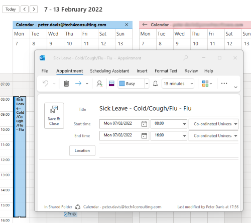

# Extension Kit Flows

## ERP Absence to Office 365 Calendar

View [here](AbsenceToCalendar/)

This is a complete flow that pushes approved absences from Unit4 ERP to a users Office 365 Calendar:

---