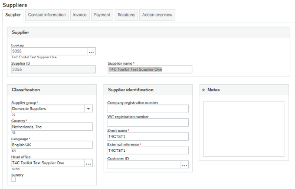
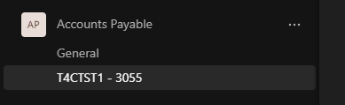
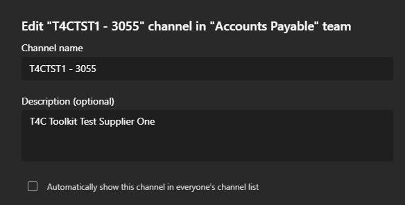

# MS Team Channel Creation (ERP7 & ERPx)

This flow demonstrates creating a channel within Microsoft Teams base on an event happening within Unit4 ERP.

In this instance we use the creation of a new supplier in Unit4 ERP to trigger the creation of a new channel in a an 'Accounts Payable' Microsoft Teams Channel.

## Created By

Peter Davis ([Tech4ConsultingDev](https://github.com/Tech4ConsultingDev)/[PancheSoftwareDev](https://github.com/PanacheSoftwareDev)) - Tech4 Consulting - [peter.davis@tech4consulting.com](mailto:peter.davis@tech4consulting.com)

## Download Flows

The exported flow can be found in the following location, you will need both JSON files and these can be imported into your Extension Kit instance via the 'Import' button within the 'Flows' area.

- [Flow Exports](FlowExport/)

## Concepts Covered

- Message Hub Event
- Calling external APIs (Microsoft Graph) using 'Bearer Token' authentication

This flow is relatively simple and contains no Liquid Scripting and minimal configuration.

This Extension Kit flow performs the following actions.

- Triggered by 'supplier' document message hub event.
- Filters for 'Added' suppliers
- Gets an MS Teams Channel ID based on it's name, in this case 'Accounts Payable'
- Creates an MS Teams channel under the 'Accounts Payable' area with a name base on the supplier name and Id. 

Supplier Master File:

MS Teams Channel Created:

## Azure AD configuration

This flow requires access to the Microsoft Graph APIs, the configuration required for this in Azure AD was detailed in the [ERP Absence to Office 365 Calendar](../AbsenceToCalendar/README.md) flow.

You should follow the guidelines there to set things up, along with configuring the parameters in Extension Kit that are described in that flow.  The only additional item is you need to add the 'Channel.Create' API permission for this flow to work.

