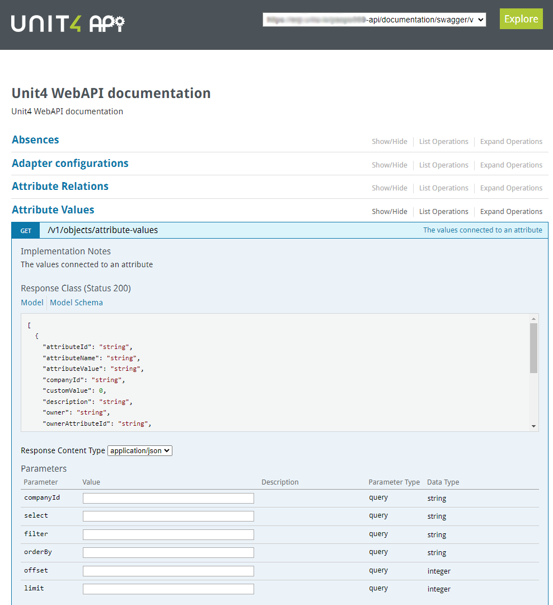
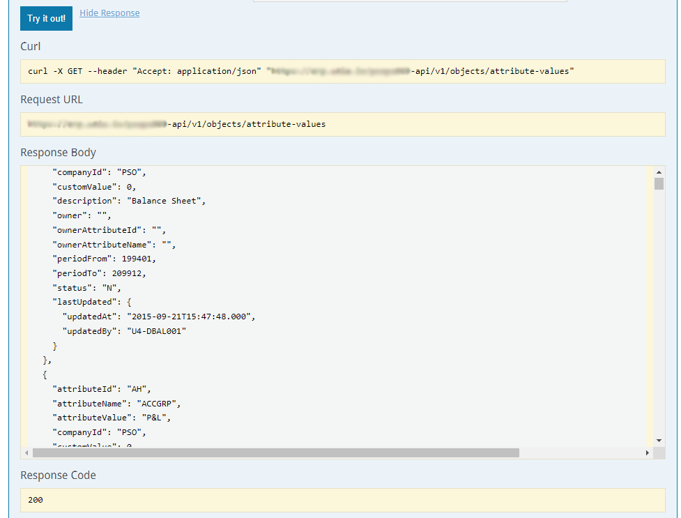
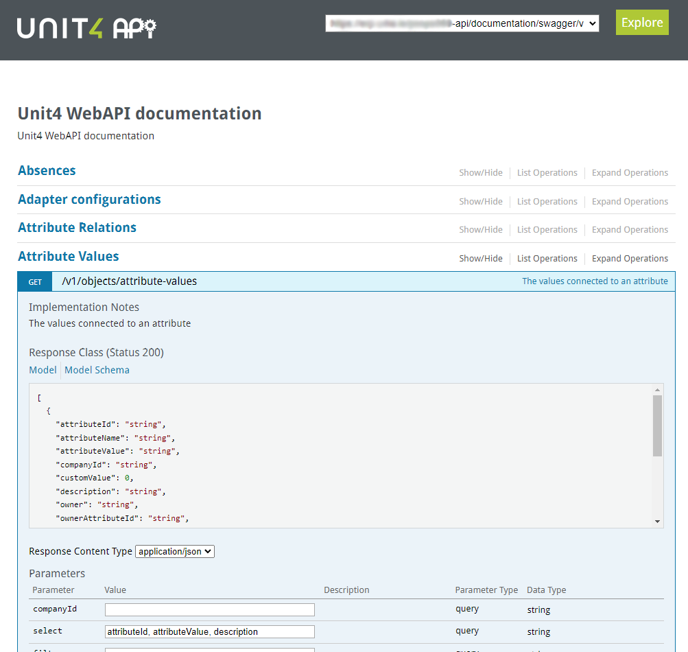
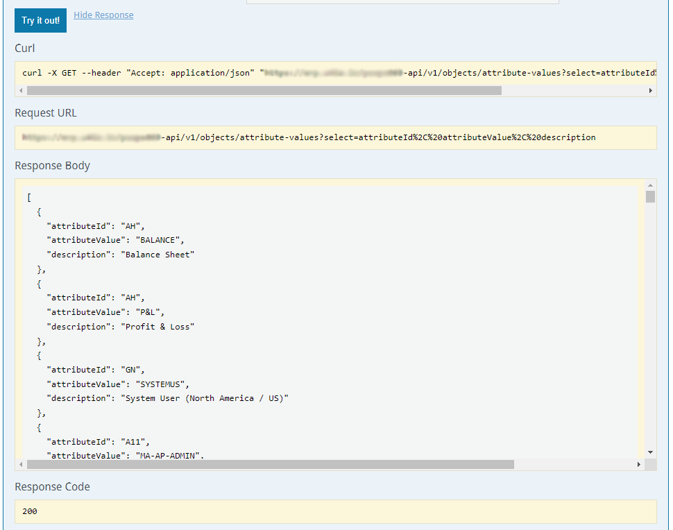
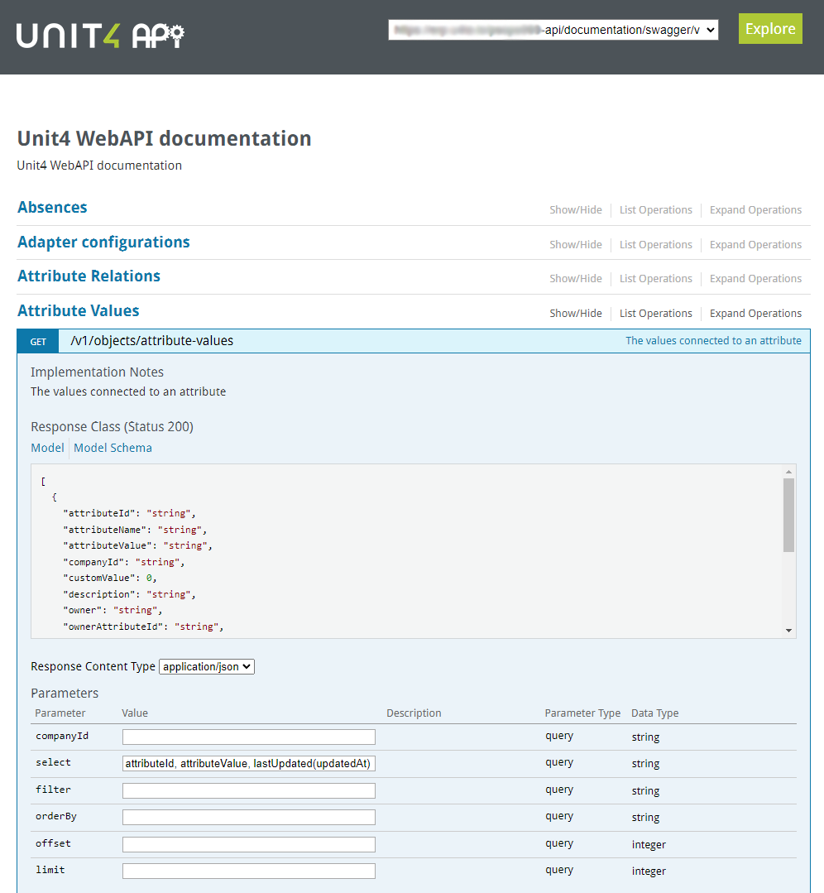
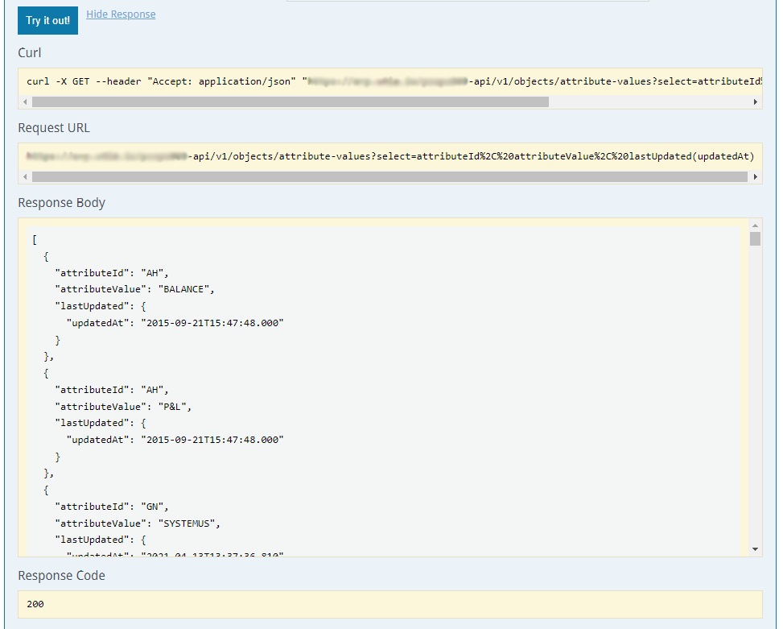

# Select attribute value data

## No restriction

If you run the 'GET' against the attribute values object with no 'select' options you will return data containing every field available

Parameters: 

Data:

---

To restrict the fields returned simply add a comma delimitted list of fields (case sensitive) to the 'select' parameter.  Here we want to return just the 'attributeId', 'attributeValue' and 'description' so we use.

attributeId, attributeValue, description

Parameters:

Data:

---

If we want to include data from 'sub' objects we add the name of the object with the field.  Here we want to include the 'last update date' along with the attribute Id and attribute value so we use.

attributeId, attributeValue, lastUpdated(updatedAt)

Parameters:

Data:

